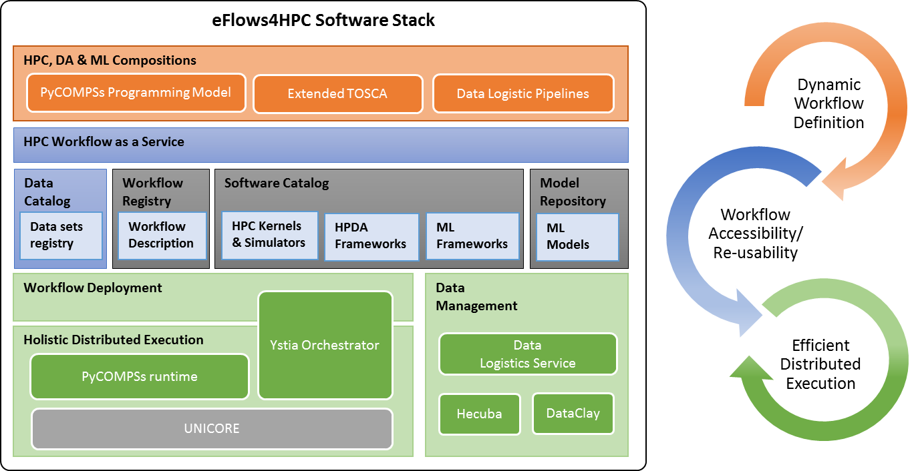
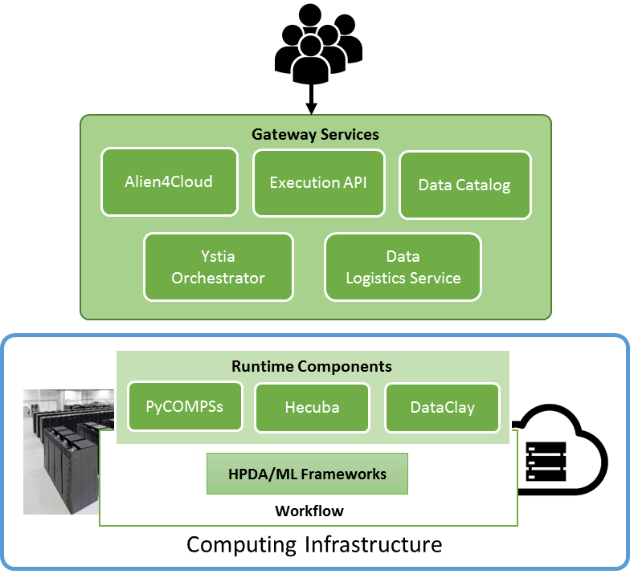

===============================
Software Stack
===============================

eFlows4HPC software stack integrates different components to provide an overall workflow management system. :numref:`fig_stack_by_functionality` shows the components included in the eFlows4HPC Software Stack accordint to their functionality. On the top, we  can find the programming models used for the definition of the complex workflows that combine HPC, HPDA and ML frameworks and the integration of large volumes of data from different sources and locations. Below this part, we can find the components to facilitate the accessibility and reusability of workflows, Finally in the bottom part of the stack we can see the different components for deployement, execution and data management. Components in grey refer to components to be developed or integrated in the stack in the future releases.

.. Comment: Once D1.1 is available on-line, we could add a link to the deliveralble

.. _fig_stack_by_functionality:

    Software Stack release overview

The different components of the stack are grouped acording to their deployment and usage as depicted in :numref:`fig_stack_by_deployment`. The Gateway Services are the components which are deployed outside the computing interface which are used to provide the HPC Workflow as a service capabilities (Alien4Cloud and Execution API), orchestrate the deployment, execution and data movement of the overall workflow (Ystia Orchestrator and Data Logistics Service).
The Runtime components are deployed in the computing infrastructure to managing the parallel execution and data management of the workflow inside the assigned computing nodes. Finally, the ML/DA Frameworks are the software components which are used inside the workflows to implement the Machine Learning and Data analytics algorithms.

.. _fig_stack_by_deployment:

    Software Stack deployment overview

Next sections provide an overview of the software stack components as well as the links to the open source repositories, installation and usage guides.

.. toctree::
    :maxdepth: 2
    :caption: Software Stack Components

    01_Software_Stack/01_Gateway_services
    01_Software_Stack/02_Runtime_components
    01_Software_Stack/03_ML_DA_frameworks
