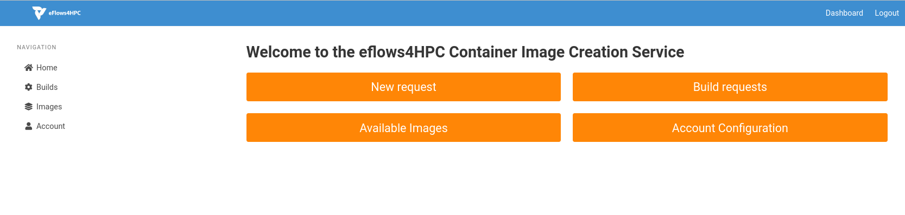
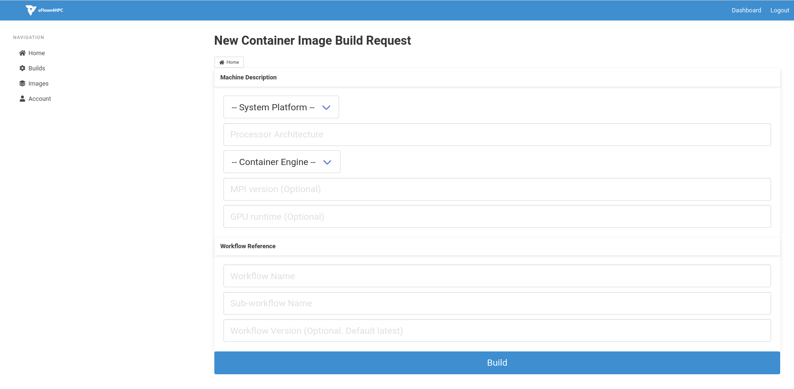
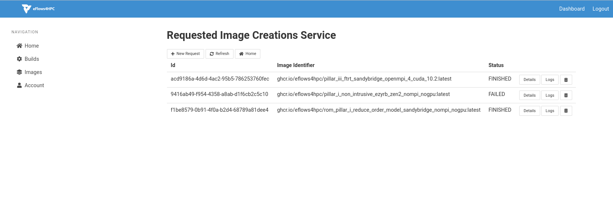
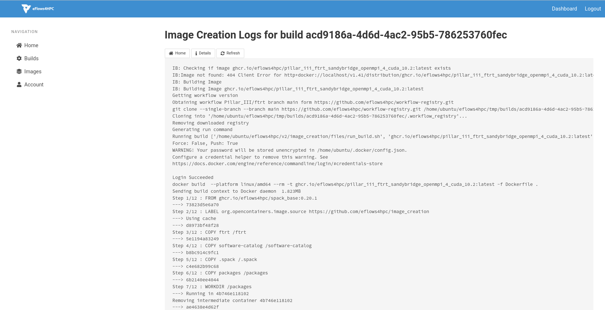
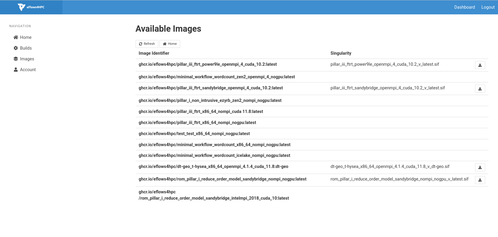
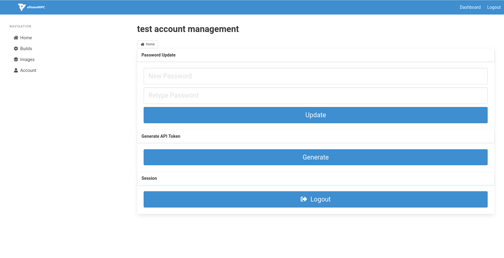

Container Image Creation
========================
This component allow to create HPC ready container images for eFlows4HPC platform for an specific workflow step and a target machine. Source code of this service can be found in this repository_.

The following paragraph provide how to install and use this component

Requirements
------------

This service requires to have Docker buildx system in the computer where running the service python > 3.7. Once, these tools have been installed, install the python modules described in requirements.txt file.

.. code:: bash

   $ pip install -r requirements.txt


Finally, clone the software catalog repository

.. code:: bash

   $ git clone https://github.com/eflows4hpc/software-catalog.git


Installation and configuration
------------------------------

Once you have installed the requirements clone the Container Image Creation repository

.. code:: bash

   $ git clone https://github.com/eflows4hpc/image_creation.git


Modify the image creation configuration, provinding the information for accessing the container registry and the location where the software catalog has been donwloaded

.. code:: bash

   $ cd image_creation
   $ vim config/configuration.py


Finally, start the service with the following command

.. code:: bash

   $ python3 builder_service.py


API
---

The Container Image Creation service offers a REST API to manage the creation of container images. The following paragraphs shows how this API works.


Trigger an image creation
`````````````````````````
This API endpoint allows the *end-user* to trigger the image creation with HTTP POST request. This request must include the description of the machine, indicating the system platform, processor architecture and the supported container engine. Optionally, it can also include the MPI version and GPU runtime version if the image requires access to MPI and GPU fabrics.

**Request**

.. code:: bash

  `POST /build/`

  {
    "machine": {
      "platform": "linux/amd64",
      "architecture": "rome",
      "container_engine": "singularity"
      "mpi": "openmpi@4"
      "gpu": "cuda@10" },
    "workflow":"minimal_workflow",
    "step_id" :"wordcount",
    "force": False
  }


**Response**

.. code:: bash

  HTTP/1.1 200 OK
  Content-Type: application/json

  {
    "id": "<creation_id>"
  }


Check status of an image creation
`````````````````````````````````
This API endpoint allows the *end-user* to check the status of an image creation.

**Request**

.. code:: bash

  GET /build/<creation_id>


**Response**

.. code:: bash

  HTTP/1.1 200 OK
  Content-Type: application/json

  {
    "status": "< PENDING | STARTED | BUILDING | CONVERTING | FINISHED | FAILED >",
    "message": "< Error message in case of failure >",
    "image_id": "< Generated docker image id >",
    "filename": "< Generated singularity image filename >"
  }


Download image
``````````````
This API endpoint allows the *end-user* to download the created image.

**Request**

.. code:: bash

  GET /images/download/<Generated singularity image filename>

**Response**

.. code:: bash

  HTTP/1.1 200 OK
  Content-Disposition: attachment
  Content-Type: application/binary


Client
------

A simple BASH client has been implemented in ``cic_cli``. This is the usage of this client.

.. code:: bash

  cic_cli <user> <passwd> <image_creation_service_url> <"build"|"status"|"download"> <json_file|build_id|image_name>


The following lines show an example of the different commands.

.. code:: bash

  $ image_creation> ./cic_cli user pass https://bscgrid20.bsc.es build test_request.json
  Response:
  {"id":"f1f4699b-9048-4ecc-aff3-1c689b855adc"}

  $ image_creation> ./cic_cli user pass https://bscgrid20.bsc.es status f1f4699b-9048-4ecc-aff3-1c689b855adc
  Response:
  {"filename":"reduce_order_model_sandybridge.sif","image_id":"ghcr.io/eflows4hpc/reduce_order_model_sandybridge","message":null,"status":"FINISHED"}

  $ image_creation> ./cic_cli user pass https://bscgrid20.bsc.es download reduce_order_model_sandybridge.sif

  --2022-05-24 16:01:28--  https://bscgrid20.bsc.es/image_creation/images/download/reduce_order_model_sandybridge.sif
  Resolving bscgrid20.bsc.es (bscgrid20.bsc.es)... 84.88.52.251
  Connecting to bscgrid20.bsc.es (bscgrid20.bsc.es)|84.88.52.251|:443... connected.
  HTTP request sent, awaiting response... 200 OK
  Length: 2339000320 (2.2G) [application/octet-stream]
  Saving to: ‘reduce_order_model_sandybridge.sif’

  reduce_order_model_sandybridge.sif        0%[                          ]   4.35M   550KB/s    eta 79m 0s

Web Graphical User Interface
----------------------------

.. _fig_CIC_home:


    Container Image Creation Service home page

The latest versions of the Container Image Creation provide a Web Graphical User Interface to facilitate the creation of images for HPC environments. :numref:`fig_CIC_home` shows the home page of this web GUI which provide the view of the main features available in the service. Users can request new  image builds, see the status and logs of the previous builds, see the already available images and managing its user account.

.. _fig_CIC_request:


    Container Image Creation Service page to request a container image build.

:numref:`fig_CIC_request` shows the web interface to make a new build request. Users has to fill a form with the details of the machine and the workflow image that they want to build. Once the form is filled in, they can press ``Build`` to start the image creation.

.. _fig_CIC_requested:


    Requested container image builds page.

Once the user, has requested the build of the image. The status of the current builds can be follow in the ``Build Requests`` page depicted in :numref:`fig_CIC_requested`. For each requested build it can see the details of the request and the logs of the execution (:numref:`fig_CIC_logs`).

.. _fig_CIC_logs:


    Requested container image build logs page.

Users can also inspect the already created images in the ``Available Images`` page (:numref:`fig_CIC_images`). In this page, users can see the Docker ID of the created images as well as downloading the Singularity image files (SIF).

.. _fig_CIC_images:


    Available container images page.

Finally, users can manage their user account details in the ``Account Configuration`` page shown in :numref:`fig_CIC_user`. In this page, users can change their password an generate API tokens.

.. _fig_CIC_user:


    Account Configuration page.


Using the Container Image Creation as Library
---------------------------------------------

To build a container image using the library mode, you have to specify a JSON file with the machine information and the workflow reference (name, step and version) in the Workflow Registry as you do in the CLI. You can also refer to a local workflow indicating the path in your localhost where we can fin the description. In this case, you must also specify a name, step and version to generate an image id to refer to the created image. Moreover you can also indicate if you want to push the generated image to the repository or just keep in your local repository. An example of this JSON file is shown below.


.. code:: bash 

   {
     "machine": {
       "platform": "linux/amd64",
       "architecture": "rome",
       "container_engine": "singularity",
       "mpi": "openmpi@4"},
     "workflow" : "tutorial" ,
     "step_id" : "lysozyme",
     "path" : "/path/to/description/",
     "force": False,
     "push" : False
   }


To run the local execution you have to run the following command:

.. code:: bash

   $ image_creation > python3 cic_builder.py --request /path/to/json_file


.. _repository: https://github.com/eflows4hpc/image_creation
