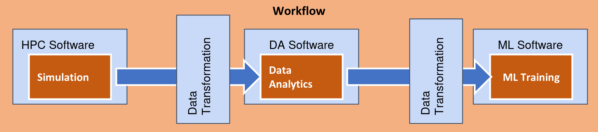

Programming Interfaces for integrating HPC and DA/ML workflows
==============================================================

The evolution of High-Performance Computing (HPC) platforms enables the design and execution of progressively more complex and larger workflow applications in these systems. The complexity comes not only from the number of elements that compose a workflow but also from the type of computations performed. While traditional HPC workflows include simulations and modelling tasks, current needs require in addition Data Analytic (DA) and artificial intelligence (AI) tasks.

However, the development of these workflows is hampered by the lack of proper programming models and environments that support the integration of HPC, DA, and AI.
Each of these workflow phases is developed using dedicated frameworks for the specific problem to solve. Nevertheless, to implement the overall workflow, developers have to deal with programming large glue code to integrate the execution of the different frameworks executions in a single workflow.

.. _fig_programming_interfaces:

    Overview of the programming interfaces to integrate HPC/DA/ML.

As we can see in :numref:`fig_programming_interfaces`, when we have to include  computations that are using different frameworks in the same application, developers have to deal with the execution of the different frameworks and how to convert the data generated by one framework to the model required by the other framework. eFlows4HPC proposes a programming interface to try to reduce the effort required to integrate different frameworks in a single workflow. This integration can be divided in two parts:

- **Software Invocation Management:** It includes the actions required to execute
  an application with a certain framework. This can be invoking just a single binary,
  a MPI application or a model training with a certain ML framework.

- **Data Integration:** In includes the transformations that the data generated
  by a framework has to be applied to be used by another framework. This
  can include transformations like transpositions, filtering or data distribution.

The proposed interface aims at declaring the different software invocations required in a workflow as simple python functions. These functions will be annotated by two decorators :

- **@software** to describe the type of execution to be performed when the function
  is invoked from the main code

- **@data_transformation** to indicate the required data transformations that needs to be applied to a parameter of the invocation to be compatible with the input of expected execution.

:numref:`overview_code` shows an overview of how the programming interfaces are used to implement a workflow. These decorators are declared on top of a
Python function which represents the execution of the software we want to integrate into the workflow. Then, the execution of the software can be included in a workflow as a call of a standard Python method, and the runtime will convert this call to the remote invocation of the described software and the implicit data transformations.

.. code-block:: python
    :name: overview_code
    :caption: Overview of a workflow implementation using the programming interfaces.

    @data_tranformation("input_data", "transformation method")
    @software("invocation description")
    def data_analytics (input_data, result):
       pass

    #Worflow
    simulation(input_cfg, sim_out)
    data_analytics(sim_out, analysis_result)
    ml_training(analysis_result, ml_model)

During the first project iteration, we defined the software invocation descriptions and extended the PyCOMPSs programming model and runtime.
In the second iteration of the eFlows4HPC framework, we have included the definition of the data transformations and
their implementations.

.. toctree::
    :maxdepth: 1

    02_Programming_Interfaces/Software_Description
    02_Programming_Interfaces/Data_Transformation
