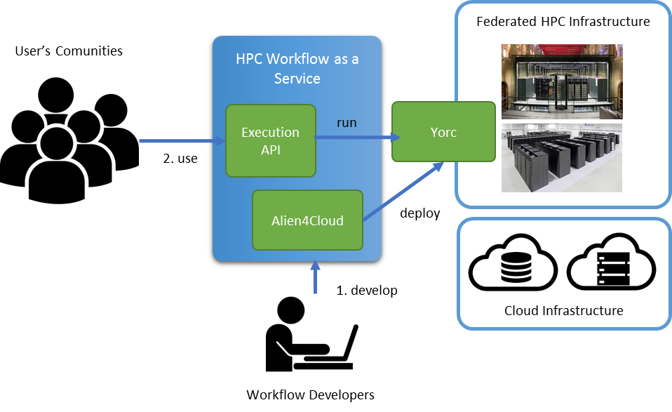

======================
HPCWaaS Methodology
======================

The eFlows4HPC proposes the HPC Workflow as a Service (HPCWaaS) methodology which tries to apply the usage model of the Functions
as a Service (FaaS) in Cloud environments to the workflows for HPC systems. In this model, two main roles are identified.
From one side, the function developer is in charge of developing and registering the function in the FaaS platform,
which transparently deploys the function in the cloud infrastructure. On the other side, the final user executes the deployed
function using a REST API. In the case of running workflows in HPC systems, we can find  similar roles. First, we can find
the workflow developer, which is charge of developing and deploying the workflow in the computing infrastructure, and the
users' communities which are usually scientist who want to execute the workflow and collect their results to advance
in their scientific goals.

.. _fig_hpcwaas:

    HPC Workfow as a Service overview

:numref:`fig_hpcwaas` shows how these two roles interacts with the proposed HPCWaaS methodology. Workflow developers implement
and describe the workflow in a way that allows the eFlows4HPC Gateway services to automatically deploy and orchestrate the workflow
execution. This is done interacting with the Development Interface offered by the Alien4Cloud tool to describe workflows as a
TOSCA application. Once the workflow is deployed users' communities can invoke this workflow using the Execution API.

Next sections provide more details about these interfaces. A simple workflow example can be found `here <04_Usage_Example.rst>`_.

.. toctree::
    :maxdepth: 1
    :caption: Table of Contents

    03_HPCWaaS_Methodology/01_Development_Interface
    03_HPCWaaS_Methodology/02_Execution_API
