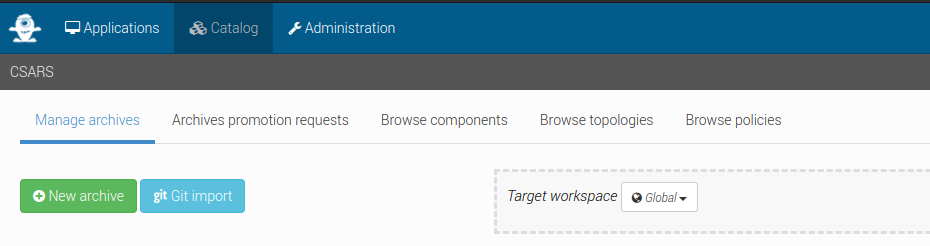
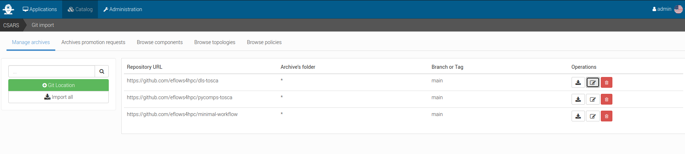
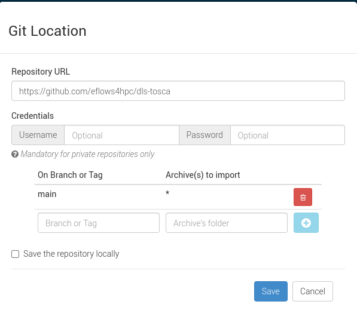
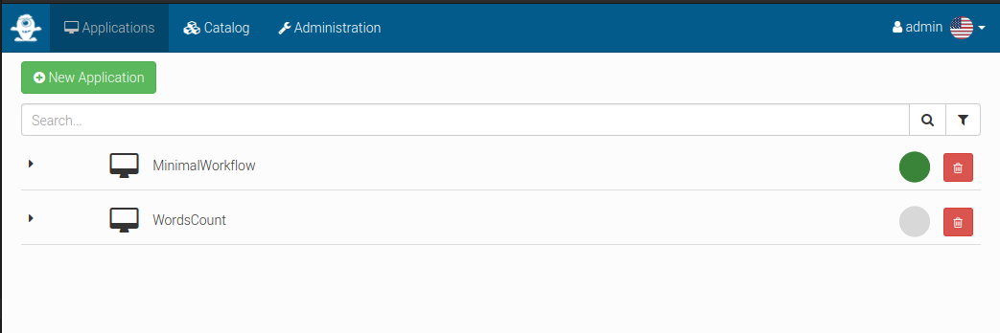
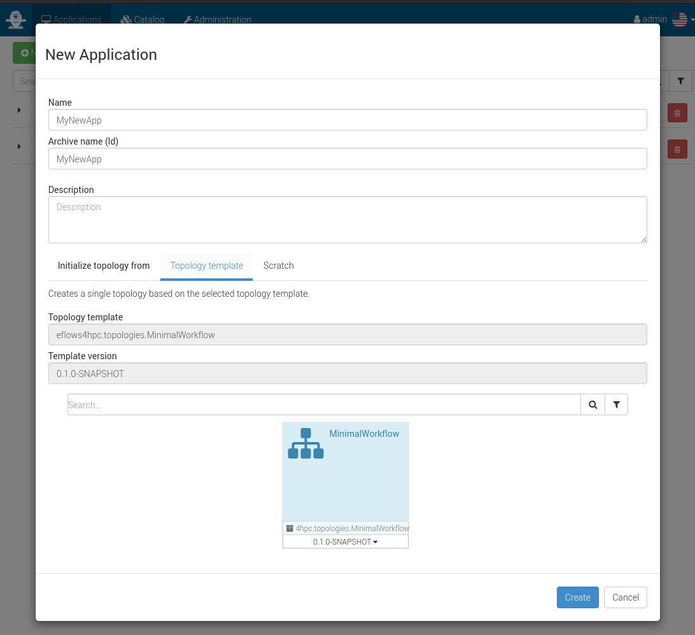
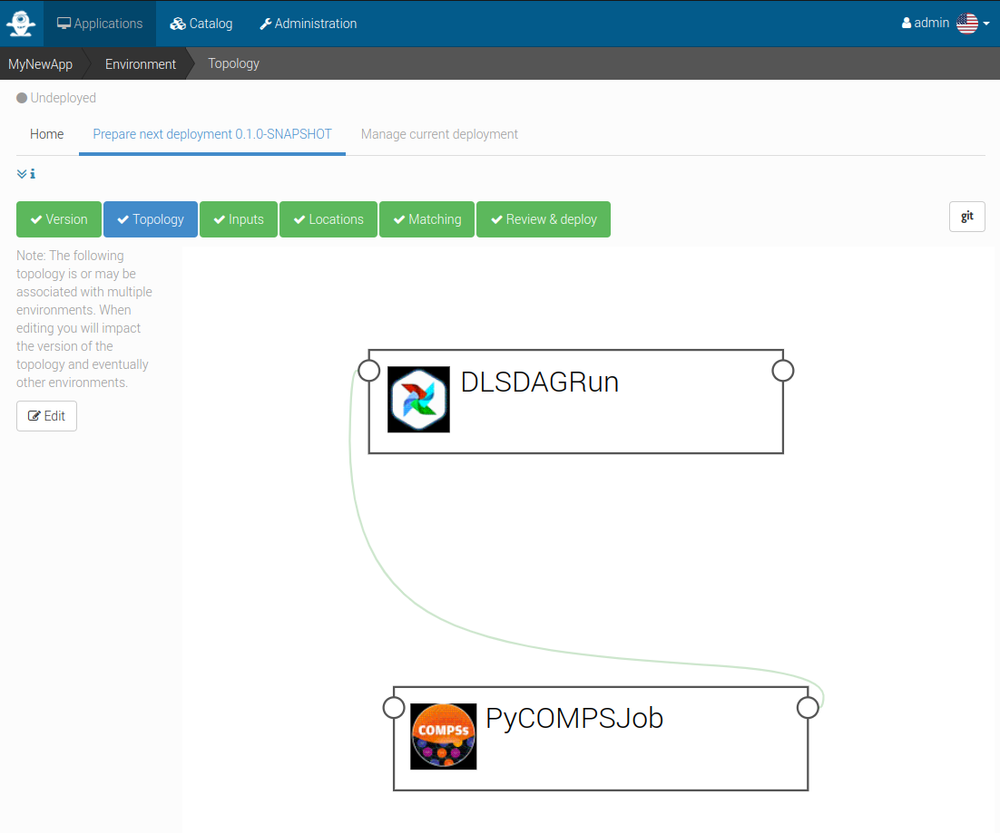
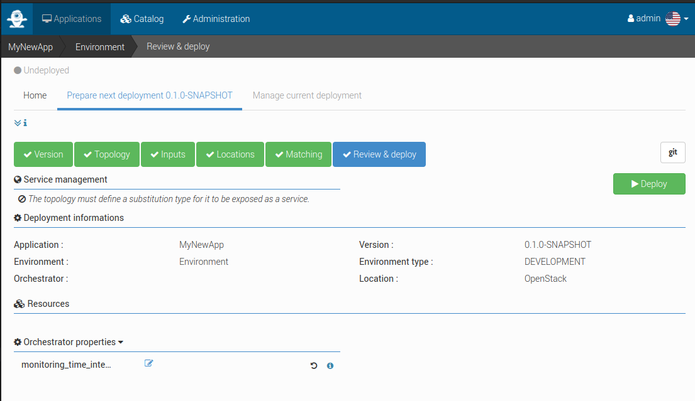
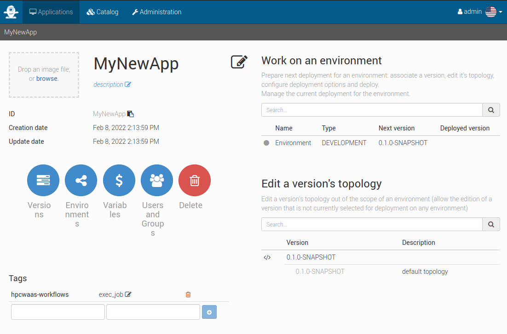

Development Interface
=====================

Setup
-----

Alien4Cloud & Yorc
##################

Please refer to the documentation of the Alien4Cloud & Yorc project for more information.

Two instances of Alien4Cloud and Yorc are deployed for the eFlows4HPC project.
One is hosted on Juelich cloud, this instance is used for testing and integration of the software stack.
The second instance is hosted on BSC cloud and is used to develop pillars use cases.
Ask to the project (eflows4hpc@bsc.es) to obtain access.

Importing required components into Alien4Cloud
##############################################

Some TOSCA components and topology templates need to be imported into Alien4Cloud.
If you are using one of the instances deployed for the eFlows4HPC project this is already done and you can move to the next paragraph.

You should first move to the ``Catalog`` tab and then the ``Manage archives`` tab, finally click on ``Git import`` to add components
as shown in :numref:`fig_alien4cloud_catalog`.

.. _fig_alien4cloud_catalog:

    Click on ``Git import`` to add components

You should have at least the three repositories defined as shown in :numref:`fig_alien4cloud_git_catalog`:

.. _fig_alien4cloud_git_catalog:

    Click on ``Git location`` to define imports from a git repository

Click on ``Git location`` to define imports from a git repository as shown in :numref:`fig_alien4cloud_git_import_setup`

.. _fig_alien4cloud_git_import_setup:

    Alien4Cloud setup a catalog git repository

Once done you can click on ``Import all``.

Creating an application based on the minimal workflow example
-------------------------------------------------------------

Move to the ``Applications`` tab and click on ``New application``  as shown in :numref:`fig_alien4cloud_applications`.

.. _fig_alien4cloud_applications:

    Manage applications in Alien4Cloud

Then create a new application based on the minimal workflow template as shown in :numref:`fig_alien4cloud_app_create`

.. _fig_alien4cloud_app_create:

    Alien4Cloud create a template based application

Edit the topology to fit your needs as shown in :numref:`fig_alien4cloud_topology`.

.. _fig_alien4cloud_topology:

    Alien4Cloud minimal workflow topology

Then click on ``Deploy`` to deploy the application as shown in :numref:`fig_alien4cloud_deploy`.

.. _fig_alien4cloud_deploy:

    Alien4Cloud deploy an application

Make your workflow available to end-users using the HPCWaaS API
---------------------------------------------------------------

In order for the HPCWaaS API to know which workflow to allow users to use, you should add a specific tag to your Alien4Cloud application.
Move to your application main panel and under the ``Tags`` section add a tag named ``hpcwaas-workflows``  as shown in :numref:`fig_alien4cloud_application_panel`.
The tag value should be a comma-separated list of workflow names that could be called through the HPCWaaS API.
In the minimal workflow example, this tag value should be ``exec_job``.

.. _fig_alien4cloud_application_panel:

    Alien4Cloud add tags to an application
