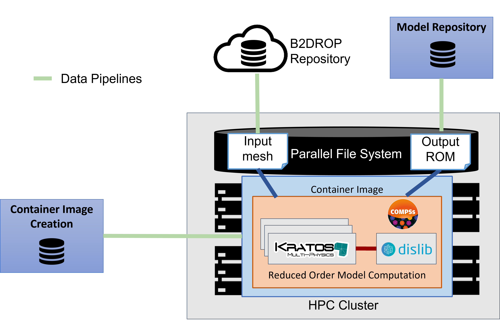

.. _section-usage-example:

====================
Step-by-step Example
====================

This chapter provides a step-by-step guide about how developers and final users can implement, deploy and execute a workflow using the eFlows4HPC Methodologies. To illustrate it, we will use one of the workflows implemented during the first period of the project.

Pillar I: Reduced Order Model workflow
--------------------------------------
:numref:`fig_overview_pillarI` shows an overview of what we want to achive with the Pillar I workflow. This workflow aims at creating a Reduced-Order Model (ROM) from the training data generated by Full Order Model (FOM) simulations. The HPC FOM simulations performed with the `Kratos Multiphysics` software are combined with distributed machine learning algorithms implemented with the `dislib`. The input for these simulations are available in HTTP repository, and the generated Reduce Order Model must be uploaded to the Model Repository in order to be available for final users. All required software will be deployed as containers in the HPC sites and all the required data movement and executions will be automatically orchestrated by the eFlows4HPC components.

.. _fig_overview_pillarI:

    Overview of the Pillar I workflow.

The following sections describe the different steps to implement, deploy and execute the Reduce Order Model workflow using the eFlows4HPC methodologies:

  - `Step 1 <04_Usage_Example/PyCOMPSs_workflow.rst>`_: Implement the computational workflow integrating different types of computations using the eFlows4HPC programming interfaces.
  - `Step 2 <04_Usage_Example/Enable_Container_Image_creation.rst>`_: Enable the automatic creation of container images by including the workflow software requirements in the workflow description.
  - `Step 3 <04_Usage_Example/Data_Logistics_Pipeline.rst>`_: Implement the data logistic pipelines to manage workflow data movements between the parallel file system of HPC clusters and external data repositories.
  - `Step 4 <04_Usage_Example/TOSCA_Description.rst>`_: Integrate the different workflow parts in TOSCA application to enable the automation of the deployment and execution processes.
  - `Step 5 <04_Usage_Example/Workflow_Deployment.rst>`_: Deploy the workflow to an HPC clusters using Alien4Cloud and make it accessible to users
  - `Step 6 <04_Usage_Example/Workflow_Execution.rst>`_: Configure the credentials and Execute the workflow with the HPCWaaS execution API

.. toctree::
   :maxdepth: 1
   :caption: Pillar I Example Steps:

   04_Usage_Example/PyCOMPSs_workflow
   04_Usage_Example/Enable_Container_Image_creation
   04_Usage_Example/Data_Logistics_Pipeline
   04_Usage_Example/TOSCA_Description
   04_Usage_Example/Workflow_Deployment
   04_Usage_Example/Workflow_Execution
