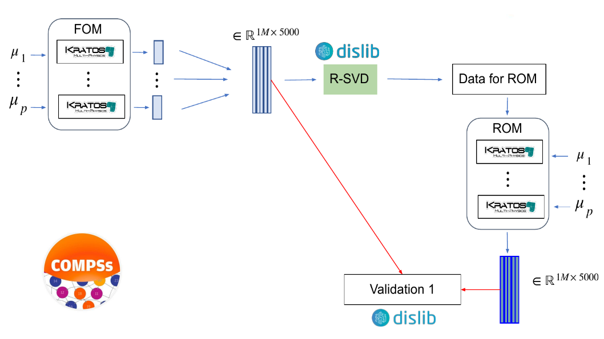

Implementation of the Reduced Order Model Computation
=====================================================
PyCOMPSs is a task-based programming model which allows developers to define parallel workflows as simple sequential python scripts. To implement a PyCOMPSs application, developers has to identify what parts of an application are the candidates to be a task. They are usually python methods with a certain computation granularity (larger than hundred milisecons) that can potentially run concurrently with other parts of the application. Those methods have to be annotated with the `@task` decorator to indicate the directionality of they parameters. Based on the task definitions, the runtime is able to detect dependencies between task invocations and infer the inherent parallelism of a python script.

PyCOMPSs has been extended in eFlows4HPC, with two new decorators (`@software` and `@dt`) to facilitate the integration of different kind of computations in PyCOMPSs workflow and facilitating their reuse in other workflows. This section will show how this methodology has been applied in the case of the Reduced Order Model (ROM) Computation, more details about the usage of this decorator for other cases can be found in the `Programming Interfaces <../02_Programming_Interfaces.rst>`_ section.

.. _fig_ROM_overview:

    Reduced Order Model Computation Overview.

:numref:`fig_ROM_overview` shows an overview of the first version of the Reduced Order Model workflow implemented in the Pillar I. The workflows starts with a set of Full Order Model simulations of the system that we want to create the ROM. These simulations are executed using the Python API of the `Kratos Multiphysics` software, and the results of these simulations are used as training data set for the ROM computation. To calculate the ROM, we have implemented the Randomized SVD algorithm using the `dislib` which implements distributed ML algorithms on top of PyCOMPSs. The worflows finishes with another set of Kratos computations which repeates the simulations using the obtained ROM and the results are compared with the FOM results.

:numref:`ROM_main_code` shows a code snippet about how the workflow has been implemented with PyCOMPSs. You can observe the main code of the workflow is a simple Python script where after parsing the arguments and loading model and parameters, the different FOM simulations (`execute_FOM_instance`) are invoked for different configuration values. The results of these simulations (`sim_results` variable) are passed to the randomized SVD computation (`rSVD`) which produces the ROM (`rom` variable). This ROM is used as input for the ROM simulations (`execute_ROM_instance`) and their results are compared invoking the `compare_ROM_vs_FOM` functions.

.. code-block:: python
    :name: ROM_main_code
    :caption: Code snippet of the PyCOMPSs code for the ROM computation.

    if __name__ == '__main__':

        model_file, sim_cfgs, desired_rank, output_rom_file = parse_arguments()
        model, parameters = load_model_parameters(model_file)

        # Full Order Model (FOM) simulation for each simulation parameter.
        sim_results=[]
        for cfg in sim_cfgs:
            sim_results.append(execute_FOM_instance(model,parameters,[cfg]))

        # Computes the "fixed rank" randomized SVD in parallel using the dislib library
        rom = rSVD(sim_results, desired_rank)

        # Reduced Order Model simulations for the same simulation parameters used for the FOM
        rom_results=[]
        for cfg in sim_cfgs:
            sim_results.append(execute_ROM_instance(model,parameters,[cfg],rom))

        compare_ROM_vs_FOM(rom_results, sim_results)

:numref:`FOM_code` and :numref:`FOM_json` shows a code snippet about how the FOM simulation has been implemented with PyCOMPSs. On top of the function which includes the Kratos Multiphysics calls we have included `@software` decorator to indicate the function is a Kratos FOM invocation described by the fom.json file stored in the Software Catalog. This description indicates that it will be executed as a task, consuming the numbers of cores indicated by $KRATOS_CUS environment variable.

.. code-block:: python
    :name: FOM_code
    :caption: Code snippet of the PyCOMPSs definition of FOM simulation.

    @software(config_file = SW_CATALOG+"/kratos/fom.json")
    def execute_FOM_instance(model,parameters, sample):
        import KratosMultiphysics
        from kratos_simulations import GetTrainingData
        current_model = KratosMultiphysics.Model()
        model.Load("ModelSerialization",current_model)
        del(model)
        current_parameters = KratosMultiphysics.Parameters()
        parameters.Load("ParametersSerialization",current_parameters)
        del(parameters)
        # get sample
        simulation = GetTrainingData(current_model,current_parameters,sample)
        simulation.Run()
        return simulation.GetSnapshotsMatrix()

.. code-block:: json
    :name: FOM_json
    :caption:  Definition of FOM simulation.

    {
        "execution" : {
                "type":"task"
        },
        "constraints" : {
                "computing_units": "$KRATOS_CUS"
        },
        "parameters" : {
                "model" : "IN",
                "parameters" : "IN",
                "sample" : "IN",
                "returns" :1
        }
    }

In the case of the randomized SVD, the code snippet can be found in :numref:`rSVD_code` and :numref:`dislib_json`. On top of the function which includes the dislib calls, we have included the `@dt` and `@software` decorators. On one side, the `@software` decorator indicates the function is a dislib code whose execution is described in the dislib.json file stored in the Software Catalog. This description indicates that it will be treated as a PyCOMPS workflow. On the other side, the `@dt` decorator indicates the transformation required to the `blocks` to the ds-array used by dislib as implemented in the `load_blocks_rechunk` function.

.. code-block:: python
    :name: rSVD_code
    :caption: Code snippet of the PyCOMPSs definition of the Randomized SVD.

    @dt("blocks", load_blocks_rechunk, shape=expected_shape, block_size=simulation_block_size,
         new_block_size=desired_block_size, is_workflow=True)
    @software(config_file = SW_CATALOG + "/py-dislib/dislib.json")
    def rSVD(blocks, desired_rank=30):
        from dislib_randomized_svd import rsvd
        u,s = rsvd(blocks, desired_rank, A_row_chunk_size, A_column_chunk_size)
        return u

.. code-block:: json
    :name: dislib_json
    :caption:  Definition of dislib algorithm.

    {
        "execution" : {
                "type" : "workflow"
        }
    }

Following the same procedure as above, we have defined the ROM simulations as depicted in :numref:`ROM_code` and the ROM/FOM comparison as depicted in :numref:`Comparison_code`. The ROM simulations have a lot of similarities to the FOM simulations, but we also added the data transformation to serialize the `rom` object to the ROM file required by Kratos Multiphysics. In the case of the ROM/FOM comparison, as it is implemented as a dislib algorithm, we have included the `load_blocks_rechunk` transformation for transforming the ROM and FOM results to dislib's ds-arrays.

.. code-block:: python
    :name: ROM_code
    :caption: Code snippet of the PyCOMPSs definition of the ROM simulation.

    @dt(target="rom", function=ROM_file_generation, type=OBJECT_TO_FILE, destination=rom_file)
    @software(config_file = SW_CATALOG + "/kratos/rom.json")
    def execute_ROM_instance(model,parameters,sample,rom):
        import KratosMultiphysics
        from kratos_simulations import RunROM_SavingData
        load_ROM(rom)
        current_model = KratosMultiphysics.Model()
        model.Load("ModelSerialization",current_model)
        del(model)
        current_parameters = KratosMultiphysics.Parameters()
        parameters.Load("ParametersSerialization",current_parameters)
        del(parameters)
        # get sample
        simulation = RunROM_SavingData(current_model,current_parameters,sample)
        simulation.Run()
        return simulation.GetSnapshotsMatrix()

.. code-block:: python
    :name: Comparison_code
    :caption: Code snippet of the PyCOMPSs definition of the ROM/FOM comparison.

    @dt("SnapshotsMatrixROM", load_blocks_rechunk, shape=expected_shape, block_size=simulation_block_size,
         new_block_size=desired_block_size, is_workflow=True)
    @dt("SnapshotsMatrixFOM", load_blocks_rechunk, shape=expected_shape, block_size=simulation_block_size,
         new_block_size=desired_block_size, is_workflow=True)
    @software(config_file = SW_CATALOG + "/py-dislib/dislib.json")
    def compare_ROM_vs_FOM(SnapshotsMatrixROM, SnapshotsMatrixFOM):
        import dislib as ds
        import numpy as np
        #using the Frobenious norm of the snapshots of the solution
        original_norm= np.linalg.norm((SnapshotsMatrixFOM.norm().collect()))
        intermediate = ds.data.matsubtract(SnapshotsMatrixROM, SnapshotsMatrixFOM) #(available on latest release)
        intermediate = np.linalg.norm((intermediate.norm().collect()))
        final = intermediate/original_norm
        np.save('relative_error_rom.npy', final)

All this code has been stored in the `Workflow Reposirory <https://github.com/eflows4hpc/workflow-registry/tree/main/rom_pillar_I/reduce_order_model/src>`_ as indicated in `this section <../01_Software_Stack/01_Gateway_services/08_Workflow_Registry.rst>`_.
