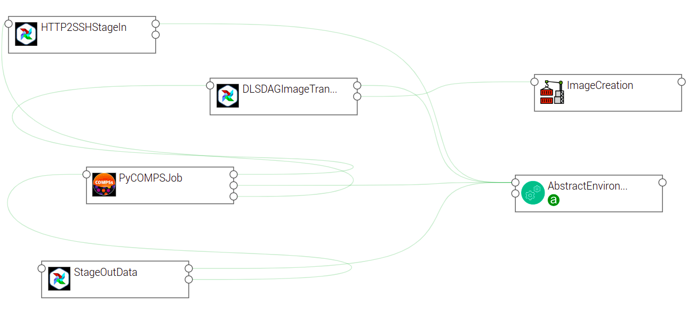

Integration in TOSCA
====================

eFlows4HPC uses TOSCA to describe the high-level execution lifecycle of a workflow, enabling the orchestration of tasks with diverse nature.
For the Pillar I use case, TOSCA is used to coordinate the creation of a container image, its transfer to a target cluster,
stage-in of input data, PyCOMPSs computation, and stage-out the computation result to a data catalog.

To support this use case, we have defined the following TOSCA components:

  * Image Creation Service TOSCA component to build container images.
  * Data Logistics Service TOSCA components to manage data movement.
  * PyCOMPSs execution TOSCA component to launch and monitor PyCOMPSs jobs.
  * Environment TOSCA component to hold properties of an HPC cluster.

In following sections you will find a detailed description of each of these components and their configurable properties.
Section :ref:`section_usage_example_tosca_topology_template` describes how these components are assembled together in a
TOSCA topology template to implement the ROM Pillar I use case. More specifically you can refer to :numref:`tosca-topo-template`
to see how properties of the TOSCA components are used in this particular context.

.. _cictosca:

Image Creation Service TOSCA component
--------------------------------------

The source code of this component is available in the `image-creation-tosca github repository <https://github.com/eflows4hpc/image-creation-tosca>`_
in the eFlows4HPC organization.

This components interacts with the Image Creation Service RESTful API to trigger and monitor the creation of container images for specific
hardware architectures.

:numref:`tosca-image-creation-service-type.yaml` is a simplified (for the sake of clarity) version of the TOSCA type definition of the
Image Creation Service that shows the configurable properties that can be set for this component.

.. code-block:: yaml
    :name: tosca-image-creation-service-type.yaml
    :caption: Extract of the TOSCA definition for Image Creation Service

    data_types:
      imagecreation.ansible.datatypes.Machine:
        derived_from: tosca.datatypes.Root
        properties:
          platform:
            type: string
            required: true
          architecture:
            type: string
            required: true
          container_engine:
            type: string
            required: true

    node_types:
      imagecreation.ansible.nodes.ImageCreation:
        derived_from: org.alien4cloud.nodes.Job
        properties:
          service_url:
            type: string
            required: true
          insecure_tls:
            type: boolean
            required: false
            default: false
          username:
            type: string
            required: true
          password:
            type: string
            required: true
          machine:
            type: imagecreation.ansible.datatypes.Machine
            required: true
          workflow:
            type: string
            required: true
          step_id:
            type: string
            required: true
          force:
            type: boolean
            required: false
            default: false
          debug:
            type: boolean
            description: Do not redact sensible information on logs
            default: false
          run_in_standard_mode:
            type: boolean
            required: false
            default: true

* The ``imagecreation.ansible.datatypes.Machine`` data type allows to define the build-specific properties for the container image to be created

  * ``platform`` is the expected operating system for instance: ``linux/amd64``
  * ``architecture`` is the expected processor architecture for instance ``sandybridge``
  * ``container_engine`` is the expected container execution engine typically ``docker`` or ``singularity``

* ``workflow`` property is the name of the workflow within the `workflow-registry github repository <https://github.com/eflows4hpc/workflow-registry>`_
* ``step_id`` property is the name of the sub step of the given workflow in the workflow registry
* ``service_url``, ``insecure_tls``, ``username`` and ``password`` are properties used to connect to the Image Creation Service
* ``force`` property allows to force the re-creation of the image even if an existing image with the same configuration already exists
* ``debug`` will print additional information in Alien4Cloud's logs, some sensible information like passwords could be reveled in these logs, this should be used for debug purpose only
* ``run_in_standard_mode`` this property controls in which TOSCA workflows this component interacts with the Image Creation Service by setting this property
  to ``true`` this components will be run in the ``standard`` mode meaning at the application deployment time.
  This is an advanced feature and the default value should fit most of the needs.

.. _dlstosca:

Data Logistics Service TOSCA components
---------------------------------------

The source code of these components is available in the `dls-tosca github repository <https://github.com/eflows4hpc/dls-tosca>`_ in the
eFlows4HPC organization.

These components interact with the Airflow RESTful API to trigger and monitor the execution of Airflow pipelines.

These components leverage TOSCA inheritance to both allow to run generic Airflow pipelines and to make it easier to create TOSCA components
with properties specific to a given pipeline.
``dls.ansible.nodes.DLSDAGRun`` is the parent of all others DLS TOSCA components. It allows to run any DLS pipeline with an arbitrary configuration.
Other DLS TOSCA components extend it by adding or overriding some properties.

:numref:`tosca-dls-type.yaml` is a simplified version of the TOSCA type definition of the
Data Logistics Service that shows the configurable properties that can be set for these components. We removed components that are
note used in the Pillar I use case.

.. code-block:: yaml
    :name: tosca-dls-type.yaml
    :caption: Extract of the TOSCA definition for DLS

    dls.ansible.nodes.DLSDAGRun:
      derived_from: org.alien4cloud.nodes.Job
      properties:
        dls_api_url:
          type: string
          required: false
        dls_api_username:
          type: string
          required: true
        dls_api_password:
          type: string
          required: true
        dag_id:
          type: string
          required: true
        extra_conf:
          type: map
          required: false
          entry_schema:
            description: map of key/value to pass to the dag as inputs
            type: string
        debug:
          type: boolean
          description: Do not redact sensible information on logs
          default: false
        user_id:
          type: string
          description: User id to use for authentication may be replaced with workflow input
          required: false
          default: ""
        vault_id:
          type: string
          description: User id to use for authentication may be replaced with workflow input
          required: false
          default: ""
        run_in_standard_mode:
          type: boolean
          required: false
          default: false
      requirements:
        - environment:
            capability: eflows4hpc.env.capabilities.ExecutionEnvironment
            relationship: tosca.relationships.DependsOn
            occurrences: [ 0, UNBOUNDED ]

    dls.ansible.nodes.HTTP2SSH:
      derived_from: dls.ansible.nodes.DLSDAGRun
      properties:
        dag_id:
          type: string
          required: true
          default: plainhttp2ssh
        url:
          type: string
          description: URL of the file to transfer
          required: false
        force:
          type: boolean
          description: Force transfer of data even if target file already exists
          required: false
          default: true
        target_host:
          type: string
          description: the remote host
          required: false
        target_path:
          type: string
          description: path of the file on the remote host
          required: false
        input_name_for_url:
          type: string
          description: >
            Name of the workflow input to use to retrieve the URL.
            If an input with this name exists for the workflow, it overrides the url property.
          required: true
          default : "url"
        input_name_for_target_path:
          type: string
          description: >
            Name of the workflow input to use to retrieve the target path.
            If an input with this name exists for the workflow, it overrides the target_path property.
          required: true
          default : "target_path"

    dls.ansible.nodes.DLSDAGStageOutData:
      derived_from: dls.ansible.nodes.DLSDAGRun
      properties:
        mid:
          type: string
          description: Uploaded Metadata ID
          required: false
        target_host:
          type: string
          description: the remote host
          required: false
        source_path:
          type: string
          description: path of the file on the remote host
          required: false
        register:
          type: boolean
          description: Should the record created in b2share be registered with data cat
          required: false
          default: false
        input_name_for_mid:
          type: string
          required: true
          default: mid
        input_name_for_source_path:
          type: string
          required: true
          default: source_path
        input_name_for_register:
          type: string
          required: true
          default: register

    dls.ansible.nodes.DLSDAGImageTransfer:
      derived_from: dls.ansible.nodes.DLSDAGRun
      properties:
        image_id:
          type: string
          description: The image id to transfer
          required: false
        target_host:
          type: string
          description: the remote host
          required: false
        target_path:
          type: string
          description: path of the file on the remote host
          required: false
        run_in_standard_mode:
          type: boolean
          required: false
          default: true

* ``dls.ansible.nodes.DLSDAGRun`` is the parent TOSCA component with the following properties:

  * ``dls_api_url``, ``dls_api_username`` and ``dls_api_password`` are used to connect to the Airflow REST API.
  
    *  ``dls_api_url`` could be overridden by the ``dls_api_url`` attribute of a ``eflows4hpc.env.nodes.AbstractEnvironment`` if components are linked together
    * ``dls_api_username`` and ``dls_api_password`` can be provided as plain text for testing purpose but the recommended way to provide it is to use the ``get_secret`` TOSCA function as shown in :numref:`tosca-topo-template`

  * ``dag_id`` is the unique identifier of the DLS pipeline to run
  * ``extra_conf`` is a map of key/value properties to be used as input parameters for the DLS pipeline
  * ``debug`` will print additional information in Alien4Cloud's logs, some sensible information like passwords could be reveled in these logs, this should be used for debug purpose only
  * ``user_id`` and ``vault_id`` are credentials to be used connect to the HPC cluster for data transfer
  * ``run_in_standard_mode`` this property controls in which TOSCA workflows this component interacts with the DLS by setting this property to ``true`` this components will be run in the ``standard`` mode meaning at the application deployment time. This is an advanced feature and the default value should fit most of the needs and it is overridden in derived TOSCA components if needed.

* ``dls.ansible.nodes.HTTP2SSH`` is a TOSCA component that allows to trigger a pipeline that will download a file and copy it to a cluster through SSH

  * ``dag_id`` overrides the pipeline identifier to ``plainhttp2ssh``
  * ``url`` is the URL of the file to be downloaded
  * ``force`` forces transfer of data even if target file already exists
  * ``target_host`` the remote host to copy file on. This could be overridden by the ``cluster_login_host`` attribute of a
    ``eflows4hpc.env.nodes.AbstractEnvironment`` if components are linked together.
  * ``input_name_for_url`` is the name of the workflow input to use to retrieve the URL. If an input with this name exists for the workflow,
    it overrides the url property. The default value is ``url``.
  * ``input_name_for_target_path`` is the name of the workflow input to use to retrieve the target path.
    If an input with this name exists for the workflow, it overrides the target_path property.
    The default value is ``target_path``.

* ``dls.ansible.nodes.DLSDAGStageOutData`` interacts with the DLS pipeline that copy data from the HPC cluster through SSH and upload it to the data catalogue

  * ``mid`` is the Metadata ID of the file in the data catalogue
  * ``target_host`` the remote host to copy data from. This could be overridden by the ``cluster_login_host`` attribute of a
    ``eflows4hpc.env.nodes.AbstractEnvironment`` if components are linked together.
  * ``source_path`` is the path of the file on the remote host
  * ``register`` controls if the record created in b2share should be registered within the data catalogue
  * ``input_name_for_mid`` is the name of the workflow input to use to retrieve the MID. If an input with this name exists for the workflow,
    it overrides the mid property. The default value is ``mid``.
  * ``input_name_for_source_path`` is the name of the workflow input to use to retrieve the source path. If an input with this name exists for the workflow,
    it overrides the source_path property. The default value is ``source_path``.
  * ``input_name_for_register`` is the name of the workflow input to use to retrieve the register flag. If an input with this name exists for the workflow,
    it overrides the register property. The default value is ``register``.

* ``dls.ansible.nodes.DLSDAGImageTransfer``:

  * ``image_id`` is the identifier of the container image to transfer from the Image Creation Service.
    If this component is linked to an Image Creation Service component then this id is automatically retrieved from the image creation execution.
  * ``target_host`` the remote host to copy the container image to. This could be overridden by the ``cluster_login_host`` attribute of a
    ``eflows4hpc.env.nodes.AbstractEnvironment`` if components are linked together.
  * ``target_path`` is the path of the container image on the remote host
  * ``run_in_standard_mode`` container image creation is typically designed to be run at application deployment time so this property is overridden
    to run at this stage.

PyCOMPSs TOSCA component
------------------------

The source code of this component is available in the
`pycompss-yorc-plugin github repository <https://github.com/eflows4hpc/pycompss-yorc-plugin/tree/main/tosca/alien>`_ in the eFlows4HPC organization.

This component is different from the above ones as it does not have an implementation in pure TOSCA.
Instead the implementation is done by a plugin directly shipped with the Yorc orchestrator.
This allows to handle more complex use-cases like interacting with workflows inputs.

That said a TOSCA component should still be defined to configure how the plugin will run the PyCOMPSs job.

:numref:`tosca-pycompss-type.yaml` is a simplified version of the TOSCA type definition of the
PyCOMPSs execution that shows the configurable properties that can be set for this component.

.. code-block:: yaml
    :name: tosca-pycompss-type.yaml
    :caption: Extract of the TOSCA definition for PyCOMPSs

    data_types:
      org.eflows4hpc.pycompss.plugin.types.ContainerOptions:
        derived_from: tosca.datatypes.Root
        properties:
          container_image:
            type: string
            required: false
            default: ""
          container_compss_path:
            type: string
            required: false
            default: ""
          container_opts:
            type: string
            required: false
            default: ""

      org.eflows4hpc.pycompss.plugin.types.COMPSsApplication:
        derived_from: tosca.datatypes.Root
        properties:
          command:
            type: string
            required: true
          arguments:
            type: list
            required: false
            entry_schema:
              description: list of arguments
              type: string
          container_opts:
            type: org.eflows4hpc.pycompss.plugin.types.ContainerOptions

      org.eflows4hpc.pycompss.plugin.types.SubmissionParams:
        derived_from: tosca.datatypes.Root
        properties:
          compss_modules:
            type: list
            required: false
            entry_schema:
              description: list of arguments
              type: string
            default: ["compss/3.0", "singularity"]
          num_nodes:
            type: integer
            required: false
            default: 1
          qos:
            type: string
            required: false
            default: debug
          python_interpreter:
            type: string
            required: false
            default: ""
          extra_compss_opts:
            type: string
            required: false
            default: ""

      org.eflows4hpc.pycompss.plugin.types.Environment:
        derived_from: tosca.datatypes.Root
        properties:
          endpoint:
            type: string
            description: The endpoint of the pycomps server
            required: false
          user_name:
            type: string
            description: user used to connect to the cluster may be overridden by a workflow input
            required: false

    node_types:
      org.eflows4hpc.pycompss.plugin.nodes.PyCOMPSJob:
        derived_from: org.alien4cloud.nodes.Job
        metadata:
          icon: COMPSs-logo.png
        properties:
          environment:
            type: org.eflows4hpc.pycompss.plugin.types.Environment
            required: false

          submission_params:
            type: org.eflows4hpc.pycompss.plugin.types.SubmissionParams
            required: false

          application:
            type: org.eflows4hpc.pycompss.plugin.types.COMPSsApplication
            required: false

          keep_environment:
            type: boolean
            default: false
            required: false
            description: keep pycompss environment for troubleshooting
        requirements:
          - img_transfer:
              capability: tosca.capabilities.Node
              relationship: tosca.relationships.DependsOn
              occurrences: [ 0, UNBOUNDED ]
          - environment:
              capability: eflows4hpc.env.capabilities.ExecutionEnvironment
              relationship: tosca.relationships.DependsOn
              occurrences: [ 0, UNBOUNDED ]

* The ``org.eflows4hpc.pycompss.plugin.types.ContainerOptions`` data type allows to define container specific options for the PyCOMPSs job

  * ``container_image`` is the path the container image to use to run the execution. If connected to a ``dls.ansible.nodes.DLSDAGImageTransfer`` component
    the path of the transferred image is automatically detected.
  * ``container_compss_path`` is the path where compss is installed in the container image
  * ``container_opts`` are the options to pass to the container engine

* The ``org.eflows4hpc.pycompss.plugin.types.COMPSsApplication`` data type allows to define how a PyCOMPSs application is run

  * ``command`` is the actual command to run
  * ``arguments`` is a list of arguments
  * ``container_opts`` is ``org.eflows4hpc.pycompss.plugin.types.ContainerOptions`` data type described above

* The ``org.eflows4hpc.pycompss.plugin.types.SubmissionParams`` data type defines PyCOMPSs parameters related to job submission

  * ``compss_modules`` is the list of modules to load for the job. This could be overridden by the ``pycompss_modules`` attribute of a
    ``eflows4hpc.env.nodes.AbstractEnvironment`` if components are linked together.
  * ``num_nodes`` is the number of nodes a job should run on
  * ``qos`` is the quality of Service to pass to the queue system
  * ``python_interpreter`` Python interpreter to use (python/python3)
  * ``extra_compss_opts`` is an arbitrary list of extra options to pass to PyCOMPSs

* The ``org.eflows4hpc.pycompss.plugin.types.Environment`` data type define properties related to the cluster where the job should be run

  * ``endpoint`` the remote host to run jobs on. This could be overridden by the ``cluster_login_host`` attribute of a
    ``eflows4hpc.env.nodes.AbstractEnvironment`` if components are linked together.
  * ``user_name`` user used to connect to the cluster may be overridden by a workflow input

* The ``org.eflows4hpc.pycompss.plugin.nodes.PyCOMPSJob`` TOSCA component

  * ``environment`` is ``org.eflows4hpc.pycompss.plugin.types.Environment`` data type described above
  * ``submission_params`` is ``org.eflows4hpc.pycompss.plugin.types.SubmissionParams`` data type described above
  * ``application`` is ``org.eflows4hpc.pycompss.plugin.types.COMPSsApplication`` data type described above
  * ``keep_environment`` is a flag to keep pycompss execution data for troubleshooting

Environment TOSCA component
---------------------------

The source code of this component is available in the `environment-tosca github repository <https://github.com/eflows4hpc/environment-tosca>`_
in the eFlows4HPC organization.

This components holds properties of an HPC cluster. It is an abstract TOSCA component, meaning that it's values does not need to be known
when designing the application and can be matched to a concrete type just before the deployment.
This is a powerful tool combined with Alien4Cloud's services that allows to define concrete types for abstract components.

:numref:`tosca-environment-type.yaml` is a simplified version of the TOSCA type definition of the
Environment that shows attributes of this component.

.. code-block:: yaml
    :name: tosca-environment-type.yaml
    :caption: Extract of the TOSCA definition for Environment

    eflows4hpc.env.nodes.AbstractEnvironment:
      derived_from: tosca.nodes.Root
      abstract: true
      attributes:
        cluster_login_host:
          type: string
        pycompss_modules:
          type: string
        dls_api_url:
          type: string

* ``cluster_login_host`` the host (generally a login node) of the HPC cluster to connects to
* ``pycompss_modules`` a coma-separated list of PyCOMPSs modules installed on this cluster and that should be loaded by PyCOMPSs
* ``dls_api_url`` the URL of the Data Logistics Service API

.. _section_usage_example_tosca_topology_template:

ROM Pillar I topology template
------------------------------

The source code of this template is available in the
`workflow-registry github repository <https://github.com/eflows4hpc/workflow-registry/tree/main/rom_pillar_I/tosca>`_ in the eFlows4HPC organization.

This topology template composes the different components described above into
a TOSCA application that allows to implement the ROM Pillar I workflow.

The ROM Pillar I workflow is composed of two phases. First at deployment time the Image Creation Service is invoked to generate a container image
containing the required softwares, this image is then transferred to the target HPC cluster using the Data Logistic Service
(the ``DLSDAGImageTransfer`` TOSCA component). Once deployed the execution workflow can be invoked as many time as required.
This execution workflow consists in transferring input data from an HTTP server to the HPC cluster thanks to the DLS
(the ``HTTP2SSH`` TOSCA component), then run a PyCOMPSs job on those data (the ``PyCOMPSJob`` TOSCA component) and finally upload computation
results to an EUDAT repository using the DLS (the ``DLSDAGStageOutData`` TOSCA component).

:numref:`tosca-topo-template` shows how are defined the components and how they are connected together in order to run in sequence.
:numref:`fig_alien4cloud_minimal_workflow_topology` shows the same topology in a graphical way.

.. code-block:: yaml
    :name: tosca-topo-template
    :caption: Extract of the TOSCA topology template for ROM Pillar I workflow

    topology_template:
      inputs:
        debug:
          type: boolean
          required: true
          default: false
          description: "Do not redact sensible information on logs"
        user_id:
          type: string
          required: false
          default: ""
          description: "User id to use for authentication may be replaced with workflow input"
        vault_id:
          type: string
          required: false
          default: ""
          description: "User id to use for authentication may be replaced with workflow input"
        container_image_transfer_directory:
          type: string
          required: false
          description: "path of the image on the remote host"
        mid:
          type: string
          required: true
          description: "Uploaded Metadata ID"
        register_result_in_datacat:
          type: boolean
          required: false
          default: false
          description: "Should the record created in b2share be registered with data cat"
      node_templates:
        StageOutData:
          type: dls.ansible.nodes.DLSDAGStageOutData
          properties:
            mid: { get_input: mid }
            register: { get_input: register_result_in_datacat }
            input_name_for_mid: mid
            input_name_for_source_path: "result_data_path"
            input_name_for_register: register
            dls_api_username: { get_secret: [/secret/data/services_secrets/dls, data=username] }
            dls_api_password: { get_secret: [/secret/data/services_secrets/dls, data=password] }
            dag_id: "upload_example"
            debug: { get_input: debug }
            run_in_standard_mode: false
          requirements:
            - dependsOnAbstractEnvironmentExec_env:
                type_requirement: environment
                node: AbstractEnvironment
                capability: eflows4hpc.env.capabilities.ExecutionEnvironment
                relationship: tosca.relationships.DependsOn
            - dependsOnPyCompsJob2Feature:
                type_requirement: dependency
                node: PyCOMPSJob
                capability: tosca.capabilities.Node
                relationship: tosca.relationships.DependsOn
        ImageCreation:
          type: imagecreation.ansible.nodes.ImageCreation
          properties:
            service_url: "https://bscgrid20.bsc.es/image_creation"
            insecure_tls: true
            username: { get_secret: [/secret/data/services_secrets/image_creation, data=user] }
            password: { get_secret: [/secret/data/services_secrets/image_creation, data=password] }
            machine:
              container_engine: singularity
              platform: "linux/amd64"
              architecture: sandybridge
            workflow: "rom_pillar_I"
            step_id: "reduce_order_model"
            force: false
            debug: { get_input: debug }
            run_in_standard_mode: true
        DLSDAGImageTransfer:
          type: dls.ansible.nodes.DLSDAGImageTransfer
          properties:
            target_path: { get_input: container_image_transfer_directory }
            run_in_standard_mode: true
            dls_api_username: { get_secret: [/secret/data/services_secrets/dls, data=username] }
            dls_api_password: { get_secret: [/secret/data/services_secrets/dls, data=password] }
            dag_id: "transfer_image"
            debug: { get_input: debug }
            user_id: { get_input: user_id }
            vault_id: { get_input: vault_id }
          requirements:
            - dependsOnImageCreationFeature:
                type_requirement: dependency
                node: ImageCreation
                capability: tosca.capabilities.Node
                relationship: tosca.relationships.DependsOn
            - dependsOnAbstractEnvironmentExec_env:
                type_requirement: environment
                node: AbstractEnvironment
                capability: eflows4hpc.env.capabilities.ExecutionEnvironment
                relationship: tosca.relationships.DependsOn
        AbstractEnvironment:
          type: eflows4hpc.env.nodes.AbstractEnvironment
        PyCOMPSJob:
          type: org.eflows4hpc.pycompss.plugin.nodes.PyCOMPSJob
          properties:
            submission_params:
              qos: debug
              python_interpreter: python3
              num_nodes: 2
              extra_compss_opts: "--cpus_per_task --env_script=/reduce_order_model/env.sh"
            application:
              container_opts:
                container_opts: "-e"
                container_compss_path: "/opt/view/compss"
              arguments:
                - "$(dirname ${staged_in_file_path})"
                - "/reduce_order_model/ProjectParameters_tmpl.json"
                - "${result_data_path}/RomParameters.json"
              command: "/reduce_order_model/src/UpdatedWorkflow.py"
            keep_environment: true
          requirements:
            - dependsOnDlsdagImageTransferFeature:
                type_requirement: img_transfer
                node: DLSDAGImageTransfer
                capability: tosca.capabilities.Node
                relationship: tosca.relationships.DependsOn
            - dependsOnAbstractEnvironmentExec_env:
                type_requirement: environment
                node: AbstractEnvironment
                capability: eflows4hpc.env.capabilities.ExecutionEnvironment
                relationship: tosca.relationships.DependsOn
            - dependsOnHttp2SshFeature:
                type_requirement: dependency
                node: HTTP2SSH
                capability: tosca.capabilities.Node
                relationship: tosca.relationships.DependsOn
        HTTP2SSH:
          type: dls.ansible.nodes.HTTP2SSH
          properties:
            dag_id: plainhttp2ssh
            url: "https://b2drop.bsc.es/index.php/s/fQ85ZLDztG2t5j3/download/GidExampleSwaped.mdpa"
            force: true
            input_name_for_url: url
            input_name_for_target_path: "staged_in_file_path"
            dls_api_username: { get_secret: [/secret/data/services_secrets/dls, data=username] }
            dls_api_password: { get_secret: [/secret/data/services_secrets/dls, data=password] }
            debug: { get_input: debug }
            user_id: ""
            vault_id: ""
            run_in_standard_mode: false
          requirements:
            - dependsOnAbstractEnvironmentExec_env:
                type_requirement: environment
                node: AbstractEnvironment
                capability: eflows4hpc.env.capabilities.ExecutionEnvironment
                relationship: tosca.relationships.DependsOn
      workflows:
        exec_job:
          inputs:
            user_id:
              type: string
              required: true
            vault_id:
              type: string
              required: true
            result_data_path:
              type: string
              required: true
            staged_in_file_path:
              type: string
              required: true
            num_nodes:
              type: integer
              required: false
              default: 1
          steps:
            StageOutData_executing:
              target: StageOutData
              activities:
                - set_state: executing
              on_success:
                - StageOutData_run
            HTTP2SSH_submitted:
              target: HTTP2SSH
              activities:
                - set_state: submitted
              on_success:
                - HTTP2SSH_executing
            PyCOMPSJob_submitting:
              target: PyCOMPSJob
              activities:
                - set_state: submitting
              on_success:
                - PyCOMPSJob_submit
            PyCOMPSJob_submit:
              target: PyCOMPSJob
              operation_host: ORCHESTRATOR
              activities:
                - call_operation: tosca.interfaces.node.lifecycle.Runnable.submit
              on_success:
                - PyCOMPSJob_submitted
            StageOutData_submitted:
              target: StageOutData
              activities:
                - set_state: submitted
              on_success:
                - StageOutData_executing
            StageOutData_submitting:
              target: StageOutData
              activities:
                - set_state: submitting
              on_success:
                - StageOutData_submit
            StageOutData_run:
              target: StageOutData
              operation_host: ORCHESTRATOR
              activities:
                - call_operation: tosca.interfaces.node.lifecycle.Runnable.run
              on_success:
                - StageOutData_executed
            HTTP2SSH_executing:
              target: HTTP2SSH
              activities:
                - set_state: executing
              on_success:
                - HTTP2SSH_run
            PyCOMPSJob_submitted:
              target: PyCOMPSJob
              activities:
                - set_state: submitted
              on_success:
                - PyCOMPSJob_executing
            HTTP2SSH_submitting:
              target: HTTP2SSH
              activities:
                - set_state: submitting
              on_success:
                - HTTP2SSH_submit
            StageOutData_submit:
              target: StageOutData
              operation_host: ORCHESTRATOR
              activities:
                - call_operation: tosca.interfaces.node.lifecycle.Runnable.submit
              on_success:
                - StageOutData_submitted
            HTTP2SSH_run:
              target: HTTP2SSH
              operation_host: ORCHESTRATOR
              activities:
                - call_operation: tosca.interfaces.node.lifecycle.Runnable.run
              on_success:
                - HTTP2SSH_executed
            HTTP2SSH_executed:
              target: HTTP2SSH
              activities:
                - set_state: executed
              on_success:
                - PyCOMPSJob_submitting
            StageOutData_executed:
              target: StageOutData
              activities:
                - set_state: executed
            PyCOMPSJob_executing:
              target: PyCOMPSJob
              activities:
                - set_state: executing
              on_success:
                - PyCOMPSJob_run
            HTTP2SSH_submit:
              target: HTTP2SSH
              operation_host: ORCHESTRATOR
              activities:
                - call_operation: tosca.interfaces.node.lifecycle.Runnable.submit
              on_success:
                - HTTP2SSH_submitted
            PyCOMPSJob_executed:
              target: PyCOMPSJob
              activities:
                - set_state: executed
              on_success:
                - StageOutData_submitting
            PyCOMPSJob_run:
              target: PyCOMPSJob
              operation_host: ORCHESTRATOR
              activities:
                - call_operation: tosca.interfaces.node.lifecycle.Runnable.run
              on_success:
                - PyCOMPSJob_executed

.. _fig_alien4cloud_minimal_workflow_topology:

    Alien4Cloud ROM Pillar I topology
