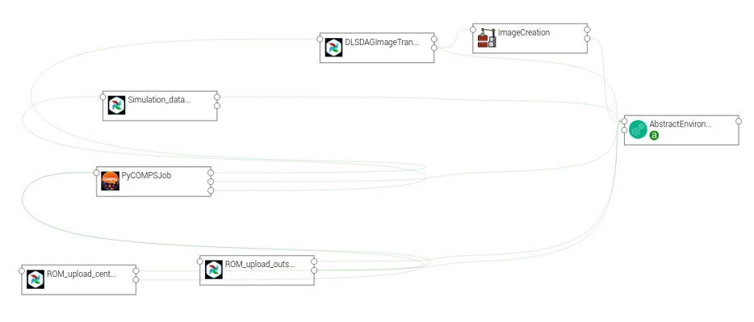

Integration in TOSCA
====================

eFlows4HPC uses TOSCA to describe the high-level execution lifecycle of a workflow, enabling the orchestration of tasks with diverse nature.
For the Pillar I use case, TOSCA is used to coordinate the creation of a container image, its transfer to a target cluster,
stage-in of input data, PyCOMPSs computation, and stage-out the computation result.

An exhaustive list of TOSCA components developed in the context of the eFlows4HPC project and their configurable properties
can be found in section :ref:`section_hpcwaas_methodology_dev_ifce_tosca_comps`.

Section :ref:`section_usage_example_tosca_topology_template` describes how these components are assembled together in a
TOSCA topology template to implement the ROM Pillar I use case. More specifically you can refer to :numref:`tosca-topo-template`
to see how properties of the TOSCA components are used in this particular context.

.. _section_usage_example_tosca_topology_template:

ROM Pillar I topology template
------------------------------

The source code of ROM Pillar I application template is available in the
`workflow-registry github repository <https://github.com/eflows4hpc/workflow-registry/tree/main/rom_pillar_I/tosca>`_ in the eFlows4HPC organization. :numref:`tosca-topo-template` shows how are defined the components and how they are connected together in order to run in sequence.
:numref:`fig_alien4cloud_minimal_workflow_topology` shows the same topology in a graphical way.

This topology template contains the different TOSCA components that allows the deployment and execution of the ROM Pilla I workflow. First, we have the ``AbstractEnvironment`` component to model the HPC cluster where the worklfow will be executed. It contains the properties required to automated the deployment and execution, such as the address of the login node, the description of the machine, etc. All components which require to know some of those HPC machine properties have a dependency with this component.
To model the deployment, the TOSCA topology contains the ``ImageCreation`` and ``DLSDAGImageTransfer`` components. They are used to model how the Image Creation Service is invoked to generate a workflow container image containing the required softwares and how it is transferred to the target HPC cluster using the ``transfer_image`` pipeline of the Data Logistic Service (Section :ref:`section-image-transfer`). The  ``DLSDAGImageTransfer`` component needs to know the generated image, so a dependency between these two components have been set.
To model the execution, we have set: the ``Simulation_data_download`` component which is modeling the transfer of input data from an HTTP server to the HPC cluster using the ``plainhttp2ssh`` pipeline of the DLS; the ``PyCOMPSJob`` component which is modeling the execution of the PyCOMPSs application in the HPC; and the ``ROM_upload_center`` and ``ROM_upload_outside`` components which are modeling the upload of the generated ROM models from the HPC cluster to the Model Respository using the ``mlflow_upload_model`` pipeline of the DLS.

.. code-block:: yaml
    :name: tosca-topo-template
    :caption: Extract of the TOSCA topology template for ROM Pillar I workflow

    topology_template:
      inputs:
        debug:
          type: boolean
          required: true
          default: false
          description: "Do not redact sensible information on logs"
        user_id:
          type: string
          required: false
          default: ""
          description: "User id to use for authentication may be replaced with workflow input"
        vault_id:
          type: string
          required: false
          default: ""
          description: "User id to use for authentication may be replaced with workflow input"
        container_image_transfer_directory:
          type: string
          required: false
          description: "path of the image on the remote host"
      node_templates:

        ImageCreation:
          type: imagecreation.ansible.nodes.ImageCreation
          properties:
            service_url: "https://bscgrid20.bsc.es/image_creation"
            insecure_tls: true
            username: { get_secret: [/secret/data/services_secrets/image_creation, data=user] }
            password: { get_secret: [/secret/data/services_secrets/image_creation, data=password] }
            machine:
              container_engine: singularity
              platform: "linux/amd64"
              architecture: sandybridge
            workflow: "rom_pillar_I"
            step_id: "reduce_order_model"
            force: false
            debug: { get_input: debug }
            run_in_standard_mode: true
        DLSDAGImageTransfer:
          type: dls.ansible.nodes.DLSDAGImageTransfer
          properties:
            target_path: { get_input: container_image_transfer_directory }
            run_in_standard_mode: true
            dls_api_username: { get_secret: [/secret/data/services_secrets/dls, data=username] }
            dls_api_password: { get_secret: [/secret/data/services_secrets/dls, data=password] }
            dag_id: "transfer_image"
            debug: { get_input: debug }
            user_id: { get_input: user_id }
            vault_id: { get_input: vault_id }
          requirements:
            - dependsOnImageCreationFeature:
                type_requirement: dependency
                node: ImageCreation
                capability: tosca.capabilities.Node
                relationship: tosca.relationships.DependsOn
            - dependsOnAbstractEnvironmentExec_env:
                type_requirement: environment
                node: AbstractEnvironment
                capability: eflows4hpc.env.capabilities.ExecutionEnvironment
                relationship: tosca.relationships.DependsOn
        AbstractEnvironment:
          type: eflows4hpc.env.nodes.AbstractEnvironment
        PyCOMPSJob:
          type: org.eflows4hpc.pycompss.plugin.nodes.PyCOMPSJob
          properties:
            submission_params:
              qos: debug
              python_interpreter: python3
              num_nodes: 2
              extra_compss_opts: "--cpus_per_task --env_script=/reduce_order_model/env.sh"
            application:
              container_opts:
                container_opts: "-e"
                container_compss_path: "/opt/view/compss"
              arguments:
                - "$(dirname ${staged_in_file_path})"
                - "/reduce_order_model/ProjectParameters_tmpl.json"
                - "${result_data_path}/RomParameters.json"
              command: "/reduce_order_model/src/UpdatedWorkflow.py"
            keep_environment: true
          requirements:
            - dependsOnDlsdagImageTransferFeature:
                type_requirement: img_transfer
                node: DLSDAGImageTransfer
                capability: tosca.capabilities.Node
                relationship: tosca.relationships.DependsOn
            - dependsOnAbstractEnvironmentExec_env:
                type_requirement: environment
                node: AbstractEnvironment
                capability: eflows4hpc.env.capabilities.ExecutionEnvironment
                relationship: tosca.relationships.DependsOn
            - dependsOnHttp2SshFeature:
                type_requirement: dependency
                node: HTTP2SSH
                capability: tosca.capabilities.Node
                relationship: tosca.relationships.DependsOn
        Simulation_data_download:
          type: dls.ansible.nodes.HTTP2SSH
          properties:
            dag_id: plainhttp2ssh
            url: "https://b2drop.bsc.es/index.php/s/fQ85ZLDztG2t5j3/download/GidExampleSwaped.mdpa"
            force: true
            input_name_for_url: url
            input_name_for_target_path: "staged_in_file_path"
            dls_api_username: { get_secret: [/secret/data/services_secrets/dls, data=username] }
            dls_api_password: { get_secret: [/secret/data/services_secrets/dls, data=password] }
            debug: { get_input: debug }
            user_id: ""
            vault_id: ""
            run_in_standard_mode: false
          requirements:
            - dependsOnAbstractEnvironmentExec_env:
                type_requirement: environment
                node: AbstractEnvironment
                capability: eflows4hpc.env.capabilities.ExecutionEnvironment
                relationship: tosca.relationships.DependsOn
        ROM_upload_center:
          metadata:
            a4c_edit_x: 139
            a4c_edit_y: "-410"
          type: dls.ansible.nodes.DLSDAGModelUpload
          properties:
            dag_id: "mlflow_upload_model"
            subfolder: center
            input_name_for_location: "rom_path"
            dls_api_username: { get_secret: [/secret/data/services_secrets/dls, data=username] }
            dls_api_password: { get_secret: [/secret/data/services_secrets/dls, data=password] }
            debug: { get_input: debug }
            user_id: ""
            vault_id: ""
            run_in_standard_mode: false
          requirements:
            - dependsOnAbstractEnvironmentExec_env:
                type_requirement: environment
                node: AbstractEnvironment
                capability: eflows4hpc.env.capabilities.ExecutionEnvironment
                relationship: tosca.relationships.DependsOn
            - dependsOnPyCompsJob2Feature:
                type_requirement: dependency
                node: PyCOMPSJob
                capability: tosca.capabilities.Node
                relationship: tosca.relationships.DependsOn
        ROM_upload_outside:
          metadata:
            a4c_edit_x: 444
            a4c_edit_y: "-410"
          type: dls.ansible.nodes.DLSDAGModelUpload
          properties:
            dag_id: "mlflow_upload_model"
            subfolder: outside
            input_name_for_location: "rom_path"
            dls_api_username: { get_secret: [/secret/data/services_secrets/dls, data=username] }
            dls_api_password: { get_secret: [/secret/data/services_secrets/dls, data=password] }
            debug: { get_input: debug }
            user_id: ""
            vault_id: ""
            run_in_standard_mode: false
          requirements:
            - dependsOnAbstractEnvironmentExec_env:
                type_requirement: environment
                node: AbstractEnvironment
                capability: eflows4hpc.env.capabilities.ExecutionEnvironment
                relationship: tosca.relationships.DependsOn
            - dependsOnPyCompsJobFeature:
                type_requirement: dependency
                node: PyCOMPSJob
                capability: tosca.capabilities.Node
                relationship: tosca.relationships.DependsOn

      workflows:
        exec_job:
          inputs:
            user_id:
              type: string
              required: true
            vault_id:
              type: string
              required: true
            data_oid:
              type: string
              required: true
            data_path:
              type: string
              required: true
            rom_path:
              type: string
              required: true
            heat_flux_parameters:
              type: string
              required: true
            num_nodes:
              type: integer
              required: false
              default: 1
          steps:
            StageOutData_executing:
              target: ROM_upload_center
              activities:
                - set_state: executing
              on_success:
                - StageOutData_run
            StageOutData_2_executing:
              target: ROM_upload_outside
              activities:
                - set_state: executing
              on_success:
                - StageOutData_2_run
            PyCOMPSJob_submitting:
              target: PyCOMPSJob
              activities:
                - set_state: submitting
              on_success:
                - PyCOMPSJob_submit
            PyCOMPSJob_submit:
              target: PyCOMPSJob
              operation_host: ORCHESTRATOR
              activities:
                - call_operation: tosca.interfaces.node.lifecycle.Runnable.submit
              on_success:
                - PyCOMPSJob_submitted
            StageOutData_submitted:
              target: ROM_upload_center
              activities:
                - set_state: submitted
              on_success:
                - StageOutData_executing
            StageOutData_2_submitted:
              target: ROM_upload_outside
              activities:
                - set_state: submitted
              on_success:
                - StageOutData_2_executing
            StageOutData_submitting:
              target: ROM_upload_center
              activities:
                - set_state: submitting
              on_success:
                - StageOutData_submit
            StageOutData_2_submitting:
              target: ROM_upload_outside
              activities:
                - set_state: submitting
              on_success:
                - StageOutData_2_submit
            StageOutData_run:
              target: ROM_upload_center
              operation_host: ORCHESTRATOR
              activities:
                - call_operation: tosca.interfaces.node.lifecycle.Runnable.run
              on_success:
                - StageOutData_executed
            StageOutData_2_run:
              target: ROM_upload_outside
              operation_host: ORCHESTRATOR
              activities:
                - call_operation: tosca.interfaces.node.lifecycle.Runnable.run
              on_success:
                - StageOutData_2_executed
            PyCOMPSJob_submitted:
              target: PyCOMPSJob
              activities:
                - set_state: submitted
              on_success:
                - PyCOMPSJob_executing
            StageOutData_submit:
              target: ROM_upload_center
              operation_host: ORCHESTRATOR
              activities:
                - call_operation: tosca.interfaces.node.lifecycle.Runnable.submit
              on_success:
                - StageOutData_submitted
            StageOutData_2_submit:
              target: ROM_upload_outside
              operation_host: ORCHESTRATOR
              activities:
                - call_operation: tosca.interfaces.node.lifecycle.Runnable.submit
              on_success:
                - StageOutData_2_submitted
            StageOutData_executed:
              target: ROM_upload_center
              activities:
                - set_state: executed
            StageOutData_2_executed:
              target: ROM_upload_outside
              activities:
                - set_state: executed
            PyCOMPSJob_executing:
              target: PyCOMPSJob
              activities:
                - set_state: executing
              on_success:
                - PyCOMPSJob_run
            PyCOMPSJob_executed:
              target: PyCOMPSJob
              activities:
                - set_state: executed
              on_success:
                - StageOutData_submitting
                - StageOutData_2_submitting
            PyCOMPSJob_run:
              target: PyCOMPSJob
              operation_host: ORCHESTRATOR
              activities:
                - call_operation: tosca.interfaces.node.lifecycle.Runnable.run
              on_success:
                - PyCOMPSJob_executed
            Simulation_data_download_run:
              target: Simulation_data_download
              activities:
                - call_operation: tosca.interfaces.node.lifecycle.Runnable.run
              on_success:
                - PyCOMPSJob_submitting
            Simulation_data_download_submit:
              target: Simulation_data_download
              activities:
                - call_operation: tosca.interfaces.node.lifecycle.Runnable.submit
              on_success:
                - Simulation_data_download_run

.. _fig_alien4cloud_minimal_workflow_topology:

    Alien4Cloud ROM Pillar I topology
