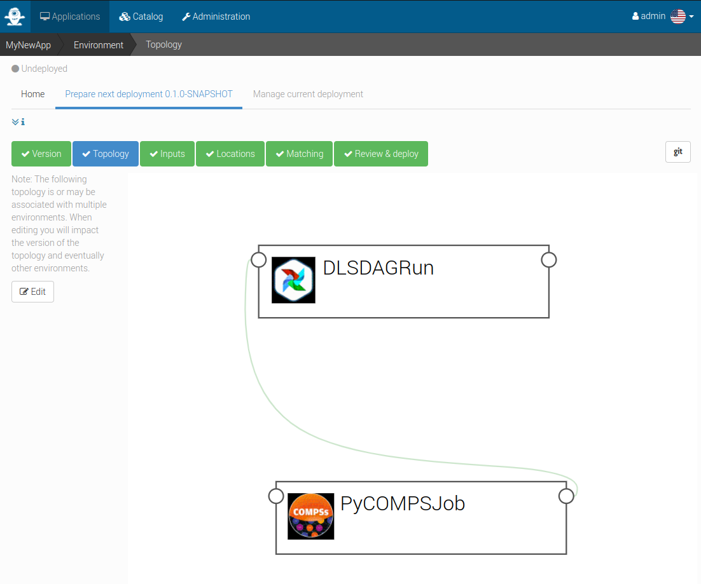

Integration in TOSCA
====================

To support the integration of this usage example we defined a set of new TOSCA components.

First we defined new types for the Data Logistics Service and PyCOMPSs workflows.
Then we defined a TOSCA topology template called the "minimal workflow" that compose these two previous components into
a TOSCA application that allows to run workflows that first transfer data from the Data Catalog to an HPC cluster and then
run a PyCOMPSs workflow.

Data Logistics Service TOSCA component
--------------------------------------

The source code of this component is available in the `dls-tosca github repository <https://github.com/eflows4hpc/dls-tosca>`_ in the
eFlows4HPC organization.

This component interacts with  the Airflow RESTful API to trigger and monitor the execution of an airflow pipeline.
It was designed to be as generic as possible in order to support different kind of pipelines.

:numref:`tosca-dls-type.yaml` is a simplified (for the sake of clarity) version of the TOSCA type definition of the
Data Logistics Service that shows the configurable properties that can be set for this component.

.. code-block:: yaml
    :name: tosca-dls-type.yaml
    :caption: Extract of the TOSCA definition for DLS

    dls.ansible.nodes.DLSDAGRun:
      derived_from: org.alien4cloud.nodes.Job
      metadata:
        icon: airflow-icon.png
      properties:
        dls_api_url:
          type: string
          required: true
        dls_api_username:
          type: string
          required: true
        dls_api_password:
          type: string
          required: true
        dag_id:
          type: string
          required: true
        oid:
          type: string
          description: Transferred Object ID
          required: true
        target_host:
          type: string
          description: the remote host
          required: true
        target_path:
          type: string
          description: path of the file on the remote host
          required: true
        extra_conf:
          type: map
          required: false
          entry_schema:
            description: map of key/value to pass to the dag as inputs
            type: string

PyCOMPSs TOSCA component
------------------------

The source code of this component is available in the
`pycomps-tosca github repository <https://github.com/eflows4hpc/pycomps-tosca>`_ in the eFlows4HPC organization.

This component connects to an HPC cluster using SSH and then run and monitor a PyCOMPSs workflow.
Again, this component was designed to be as generic as possible in order to support different kind of workflows.

:numref:`tosca-pycomps-type.yaml` is a simplified (for the sake of clarity) version of the TOSCA type definition of the
PyCOMPSs workflow that shows the configurable properties that can be set for this component.

.. code-block:: yaml
    :name: tosca-pycomps-type.yaml
    :caption: Extract of the TOSCA definition for PyCOMPSs

    pycomps.ansible.nodes.PyCOMPSJob:
      derived_from: org.alien4cloud.nodes.Job
      metadata:
        icon: COMPSs-logo.png
      properties:
        pycomps_endpoint:
          type: string
          description: The endpoint of the PyCOMPSs server
          required: true
        num_nodes:
          type: integer
          required: false
          default: 1
        data_path:
          type: string
          required: false
          default: ""
        command:
          type: string
          required: true
        arguments:
          type: list
          required: false
          entry_schema:
            description: list of arguments
            type: string

Minimal workflow TOSCA topology template
----------------------------------------

The source code of this template is available in the
`minimal-workflow github repository <https://github.com/eflows4hpc/minimal-workflow>`_ in the eFlows4HPC organization.

This topology template composes the DLS and PyCOMPSs components into
a TOSCA application that allows to run a workflow which first transfer a data from the Data Catalog to an HPC cluster and then
run an PyCOMPSs workflow.

:numref:`tosca-topo-template` shows how are defined the components and how they are connected together in order to run in sequence.
:numref:`fig_alien4cloud_minimal_workflow_topology` shows the same topology in a graphical way.

.. code-block:: yaml
    :name: tosca-topo-template
    :caption: Extract of the TOSCA topology template for the minimal workflow

    topology_template:
      inputs:
        dls_api_username:
          type: string
          required: true
        dls_api_password:
          type: string
          required: true
      node_templates:
        DLSDAGRun:
          metadata:
            a4c_edit_x: 231
            a4c_edit_y: "-339"
          type: dls.ansible.nodes.DLSDAGRun
          properties:
            dls_api_url: "http://134.94.199.73:7001/api/v1"
            dls_api_username: { get_input: dls_api_username }
            dls_api_password: { get_input: dls_api_password }
            dag_id: "taskflow_example"
            oid: dba52935c7e444d198b377876b4fe0a8
            target_host: "amdlogin.bsc.es"
            target_path: "/home/bsc44/bsc44070/dls_transfert/data/"
        PyCOMPSJob:
          metadata:
            a4c_edit_x: 243
            a4c_edit_y: "-176"
          type: pycomps.ansible.nodes.PyCOMPSJob
          properties:
            pycomps_endpoint: "amdlogin.bsc.es"
            num_nodes: 2
            data_path: "/home/bsc44/bsc44070/dls_transfert/data/"
            command: "~/wordcount_blocks/src/wordcount_blocks.py"
            arguments:
              - "${DATA_PATH}/data.txt"
              - "${DATA_PATH}/result.txt"
              - 3000
          requirements:
            - dependsOnDlsdagRunFeature:
                type_requirement: dependency
                node: DLSDAGRun
                capability: tosca.capabilities.Node
                relationship: tosca.relationships.DependsOn

.. _fig_alien4cloud_minimal_workflow_topology:

    Alien4Cloud minimal workflow topology

:numref:`tosca-exec-job` shows inputs that are required to run the workflow.

.. code-block:: yaml
    :name: tosca-exec-job
    :caption: Extract of the TOSCA definition for PyCOMPSs

    workflows:
      exec_job:
        inputs:
          user_id:
            type: string
            required: true
          oid:
            type: string
            required: true
          target_path:
            type: string
            required: true
          num_nodes:
            type: integer
            required: false
            default: 1

