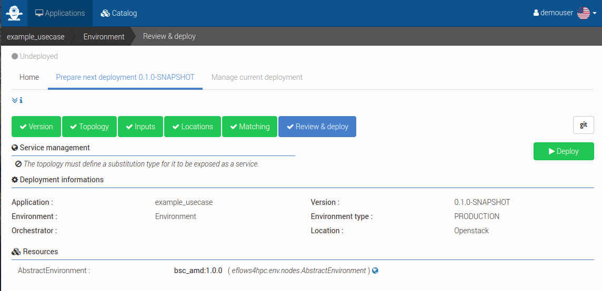
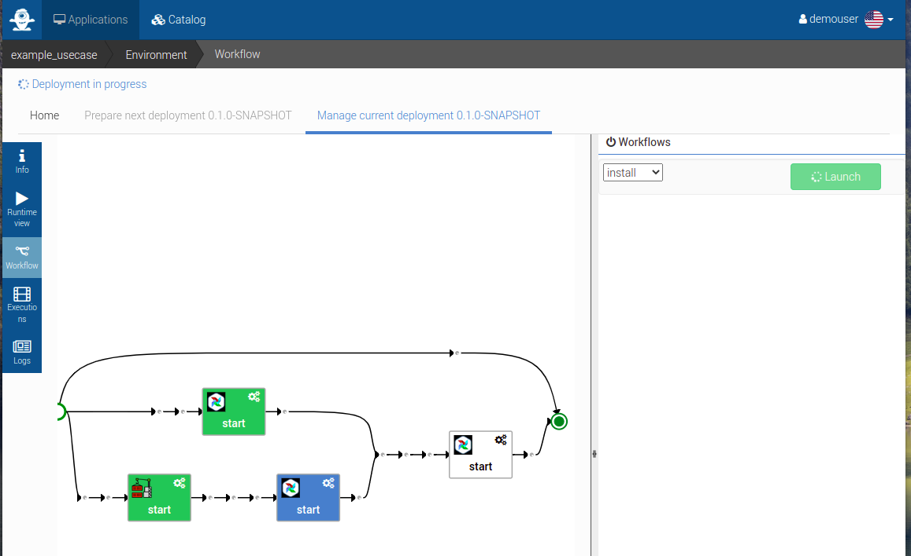
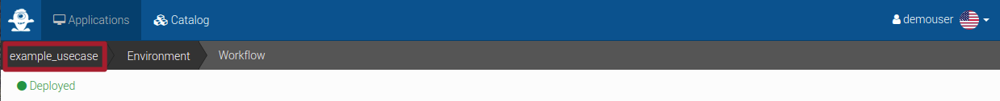

Workflow Deployment
===================

In this section, we will provide guidance on how to deploy workflows as a "Workflow Developer" in eFlows4HPC.
A "Workflow Developer" is responsible for defining and deploying workflows that can be triggered by "end-users" through the HPCWaaS API.

The main interaction for a workflow developer is with Alien4Cloud, where TOSCA applications and associated TOSCA workflows are defined.
In this guide, we will utilize the TOSCA Topology Template feature in Alien4Cloud to create an application from a pre-existing template
and configure it to meet our specific needs prior to deployment. Upon deployment, we will cover how to test workflows, as well as expose
the application to the HPCWaaS API for end-user access.

Create an application from a Topology Template
----------------------------------------------

:numref:`fig__ex_alien_create_app` shows how to create an application from a topology template.
Log in to Alien4Cloud and navigate to the ``Applications`` tab. Click on the
``New Application`` button, provide a unique name for the application, and then switch to the ``Topology Template`` tab under the
``Initialize topology from`` section. Select the desired topology template and click the ``Create`` button.

.. _fig__ex_alien_create_app:

    Create an application from a Topology Template

Configure the application before deployment
-------------------------------------------

To prepare for deployment, navigate to the ``Environment`` section under ``Work on an Environment`` (see :numref:`fig__ex_alien_select_env`).
Then click on ``Prepare next deployment`` (see :numref:`fig__ex_alien_prepare_next_dep`)
and select the proposed location (see :numref:`fig__ex_alien_select_loc`).

.. _fig__ex_alien_select_env:

    Select the environment

.. _fig__ex_alien_prepare_next_dep:

    Prepare next deployment

.. _fig__ex_alien_select_loc:
.. figure:: ../Figures/AlienSelectLoc.png
    :figwidth: 75 %
    :alt: Alien4Cloud select location
    :align: center

    Select location

Under the ``Topology`` tab, you can examine the TOSCA topology created from the template and make any necessary modifications.
In most cases, this step is not required as the topology is designed to be configurable through defined ``inputs``.
Access the ``Inputs`` tab and fill all necessary inputs (see :numref:`fig__ex_alien_depl_inputs`). Note that the information bubble provides additional input description.

.. _fig__ex_alien_depl_inputs:

    Fill deployment inputs

It is important to understand that these inputs are fixed properties that will be selected prior to deployment and cannot be altered
for a specific workflow execution. To do this workflows can be defined with their own specific inputs.

Next, under the ``Matching`` tab (see :numref:`fig__ex_alien_matching`), you should match abstract TOSCA components to their concrete implementations.
This enables the definition of reusable topologies and facilitates their adaptation to target specific HPC clusters, such as the login
node address or the PyCOMPSs modules to be loaded for job execution.
To do this, click on the ``Nodes matching`` tab and expand the ``AbstractEnvironment`` node.
Finally, select the desired concrete implementation for the execution environment.

.. _fig__ex_alien_matching:

    Match abstract components to concrete implementations

Deploy an application
---------------------

To finalize the deployment process, navigate to the ``Review and deploy`` tab (see :numref:`fig__ex_alien_deploy_app`). Carefully review the configurations made in previous sections and,
if satisfactory, click the ``Deploy`` button.

.. _fig__ex_alien_deploy_app:

    Deploy application

You will be automatically redirected to the ``Manage current deployment`` tab (see :numref:`fig__ex_alien_deploy`).
Here, you can monitor the progress of the deployment.
For more comprehensive insights, you may access the ``Workflow`` (see :numref:`fig__ex_alien_deploy_workflow_view`)
or ``Logs`` (see :numref:`fig__ex_alien_deploy_logs_view`) tabs.

.. _fig__ex_alien_deploy:

    Deployment of an application

.. _fig__ex_alien_deploy_workflow_view:

    Workflow view of a deployment of an application

.. _fig__ex_alien_deploy_logs_view:

    Logs view of a deployment of an application

Wait for the deployment workflow to complete before moving to the next section.

Test a workflow directly from Alien4Cloud
-----------------------------------------

As a workflow developer, it is advisable to perform testing of the workflow prior to making it available to end-users.
This can be achieved directly within Alien4Cloud without the need for additional tools.
To initiate the testing process, navigate to the ``Workflow`` tab and select the desired execution workflow from the dropdown menu
(see :numref:`fig__ex_alien_test_wf`).
Next, provide the necessary inputs for the workflow and initiate the launch by clicking on the ``Launch`` button.

.. _fig__ex_alien_test_wf:

    Triggering a workflow for testing purpose

The execution of this workflow can be monitored in a similar manner as previously described in the previous section,
by accessing the Manage current deployment tab and monitoring its progress through the ``Workflow`` or ``Logs`` tabs.

Expose a workflow to the HPCWaaS API
------------------------------------

To expose your application to the HPCWaaS API, navigate to the main page of your application by clicking on its name in the top left corner
(see :numref:`fig__ex_alien_back_app`).

.. _fig__ex_alien_back_app:

    Back to application's main page

Utilize the ``Tags`` section to configure the interaction between your application and the HPCWaaS API  (see :numref:`fig__ex_alien_set_tags`).
The following tags are recognized by the HPCWaaS API:

* ``hpcwaas-workflows`` represents a list of comma-separated workflows names from your application that should be made available to the API.

* ``hpcwaas-authorized-users`` refers to a list of comma-separated users who are authorized to utilize this workflow.
  If this tag is not specified, all authenticated users will have access to the workflow.

.. _fig__ex_alien_set_tags:

    Configure application tags
