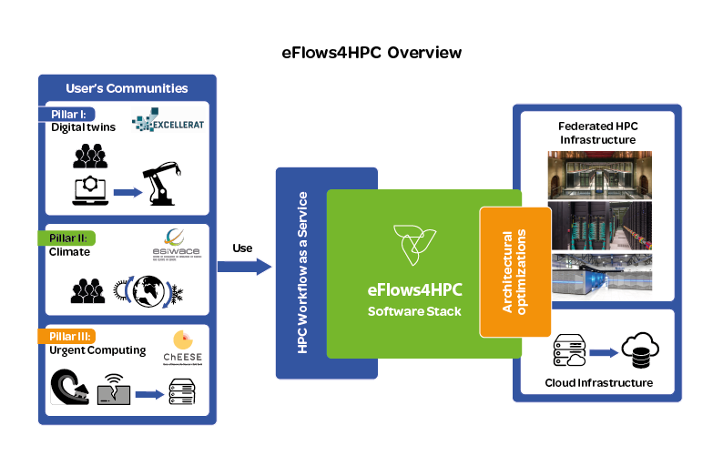
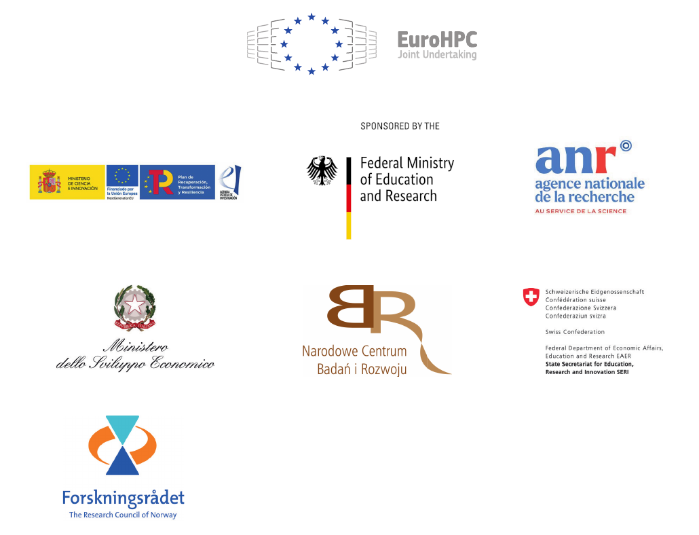

===================
eFlows4HPC Overview
===================
.. _fig_overview:

eFlows4HPC aims at designing and implementing a European workflow platform that enables the design of complex applications that integrate HPC processes, data analytics and artificial intelligence, making use of the HPC resources in an easy, efficient and responsible way as well as enabling the accessibility and reusability of applications to reduce the time to solution.

As the main outcome, the project is delivering the eFlows4HPC software stack which integrates different components to provide an overall workflow management system. One of the core functionalities of the software stack is the definition of the complex workflows that combine HPC, HPDA and ML frameworks and the integration of large volumes of data from different sources and locations.

On top of this software stack, the project builds an HPC Workflow as a Service (HPCWaaS) platform to facilitate the reusability of these complex workflows in federated HPC infrastructure. The goal is to provide methodologies and tools that enable sharing and reuse of existing workflows and that assist when adapting workflow templates to create new workflow instances.

The HPCWaaS platform and the eFlows4HPC software stack will be validated by use cases organised in three pillars which represent the main sectors that the project targets.

-----------------
More information:
-----------------

- Project website: https://www.eflows4hpc.eu

- Github organization: https://github.com/eflows4hpc

----------------
Acknowledgements
----------------

The eFlows4HPC project is founded by the European High-Performance Computing Joint Undertaking (JU) under grant agreement No 955558. The JU receives support from the European Union’s Horizon 2020 research and innovation programme and Spain, Germany, France, Italy, Poland, Switzerland, Norway

